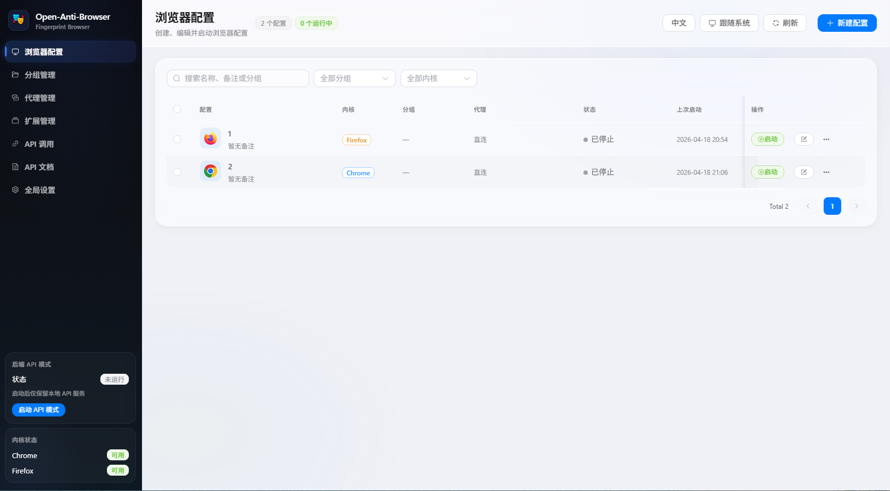
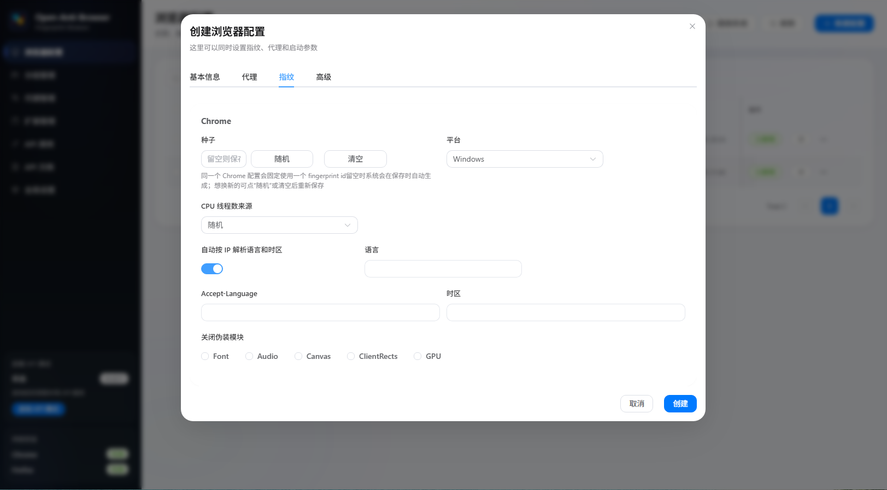
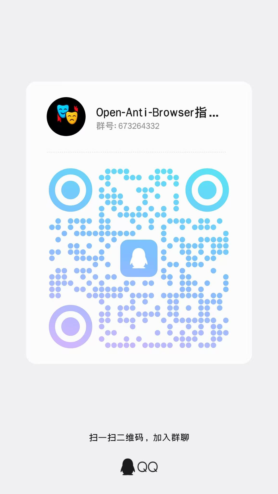



  

# Open-Anti-Browser

[中文说明](./README.md)

Open-Anti-Browser is a local desktop manager for fingerprint browser profiles

It brings two publicly available fingerprint browser engines into one interface for profile creation, proxy management, extension management, browser launching, and local API automation

The interface follows an iOS-inspired style and supports light and dark mode switching

  

  

## Feature overview

### Profiles and fingerprints

- Chrome and Firefox fingerprint browser engines
- Isolated user-data directory for every browser profile
- Profile name, group, notes, proxy, launch arguments, and startup URLs
- Chrome supports stable `fingerprint id`, platform selection, language and timezone overrides, CPU thread mode, and launch window size
- Firefox supports language and timezone, font system, screen size, WebGL, WebRTC, CPU threads, extra fingerprint fields, and custom fingerprint file path
- Automatic language and timezone resolution from IP, written into the selected browser profile

### Proxies and extensions

- Saved proxies, connectivity test, and bulk proxy assignment
- Global extension manager for Chrome and Firefox
- Upload extension packages or select an existing extension folder
- Enabled global extensions load automatically for profiles using the same engine
- A single browser profile can disable selected global extensions when needed

### Tab tools

- Open multiple URLs in batch
- Open the first URL in the current tab, or open every URL as a new tab
- Unify follower windows to the master window URL
- Close the current tab in batch
- Close other tabs in batch
- Close blank tabs and new-tab pages in batch

### Synchronizer

- Select one master window and multiple follower windows
- Sync page navigation, clicks, text input, scrolling, keyboard actions, and mouse movement
- Sync browser UI actions, including address-bar navigation, new tabs, active tab switching, and tab closing
- Sync the master window URL to all followers when synchronization starts
- Show windows, set uniform size, and arrange windows automatically
- Text tools for clearing input, same text input, random number input, and designated text groups
- Sync delay settings, hotkey settings, and per-action sync switches

### API and desktop experience

- Local API Key, backend API mode, and built-in API documentation
- Browser launch responses include the local debug port for automation clients
- Batch start and stop by profile group
- Single-instance desktop app, tray minimize, and light or dark theme switching

## Download

- Installer release page: [Releases](https://github.com/Wtcity22/Open-Anti-Browser/releases)
- Source repository: [Wtcity22/Open-Anti-Browser](https://github.com/Wtcity22/Open-Anti-Browser)

## Contact Me
- email: wtcity22@gmail.com
- tg: @NetOriginDev

## Community group

You are welcome to join the QQ group to share usage tips, report issues, and exchange ideas with other users

  

## Engine sources

### Chromium 144

- Project: [adryfish/fingerprint-chromium](https://github.com/adryfish/fingerprint-chromium)
- Bundled version used by this project: Chromium 144

### Firefox 151

- Project: [LoseNine/firefox-fingerprintBrowser](https://github.com/LoseNine/firefox-fingerprintBrowser)
- Automation library: [LoseNine/ruyipage](https://github.com/LoseNine/ruyipage)
- Bundled version used by this project: Firefox 151

### Automation clients

- Recommended for Chrome: [Patchright](https://github.com/Kaliiiiiiiiii-Vinyzu/patchright)
- Recommended for Firefox: [RuyiPage](https://github.com/LoseNine/ruyipage)

## Fingerprint support

| Item | Chrome | Firefox |
| --- | --- | --- |
| Stable fingerprint identity | `fingerprint id` | Managed through `fpfile` |
| Language and timezone from IP | Supported | Supported |
| Platform settings | Windows / macOS / Linux | Font system selection |
| CPU threads | Auto / manual / random | Auto / manual / random |
| Screen settings | Launch window size | Auto / manual / random screen size |
| WebRTC | Follows proxy and launch settings | Auto / manual / random |
| WebGL | Provided by the engine | Auto / manual / random |
| Extra launch arguments | Supported | Supported |
| Startup URLs | Supported | Supported |
| Global extensions | Supported | Supported |

## Main Chrome options

- Stable or regenerated fingerprint id
- Auto language and timezone resolution from IP
- Manual language, Accept-Language, and timezone override
- Platform selection
- CPU thread mode: auto, manual, random
- Disable selected spoofing modules
- Extra launch arguments
- Launch window size
- Startup URLs
- Per-profile global extension override

## Main Firefox options

- Auto language and timezone resolution from IP
- Manual language and timezone override
- Font system selection
- Screen size mode: auto, manual, random
- WebGL mode: auto, manual, random
- CPU thread mode: auto, manual, random
- WebRTC mode: auto, manual, random
- Built-in WebRTC block extension
- Extra fingerprint fields
- Custom fingerprint file path
- Extra launch arguments
- Startup URLs
- Per-profile global extension override

## Usage

### 1 Create a browser profile

- Choose Chrome or Firefox
- Fill in name, group, and remark
- Select a saved proxy or use direct connection
- Adjust fingerprint settings for the selected engine
- Save and launch

### 2 Manage proxies

- Save commonly used proxies in the proxy manager
- Test connectivity before assigning them
- Assign one proxy to multiple profiles in bulk

### 3 Manage extensions

- Upload Chrome and Firefox extensions separately
- Enabled extensions load automatically for profiles using the same engine
- A single profile can disable selected global extensions

### 4 Use the local API

- Open API Access in the sidebar to view the local URL and API Key
- Open API Docs for endpoints, parameters, and examples
- The profile start endpoint returns the automation debug port as `port`

## Automation examples

### Chrome

After Chrome starts, use the returned local debug port with Patchright through CDP

### Firefox

After Firefox starts, use the returned port with RuyiPage

## Source code and build

- The source code is publicly available
- To reduce commercial abuse, this README does not include ready-to-run build steps
- The public repository does not include installer packaging scripts or ready-made build configuration
- If you want to study the build flow, please work it out from the source tree on your own

## Notes

- The Releases page provides ready-to-install builds
- The source repository intentionally excludes engine binaries, build outputs, runtime data, and local test cache
- Frontend source code is under `frontend/src`
- Backend API entry is `backend/main.py`

## Usage boundaries

- This is an open-source project and it is not sold as a paid product
- This project is intended for local development, automation debugging, testing, and compliant research
- Do not use this project for illegal activity, unauthorized access, platform abuse, or infringement
- Users are responsible for following local laws and the rules of any platform they interact with
